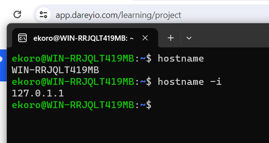
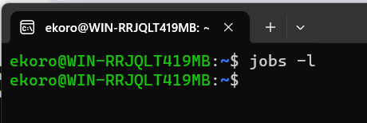
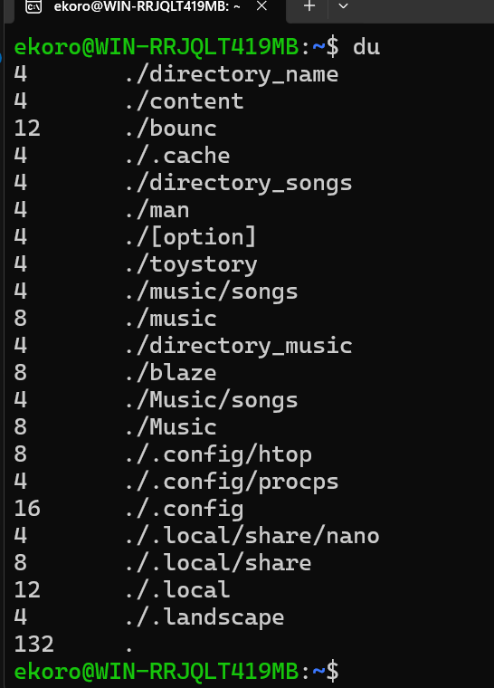
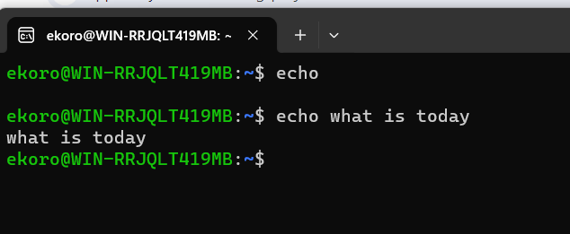
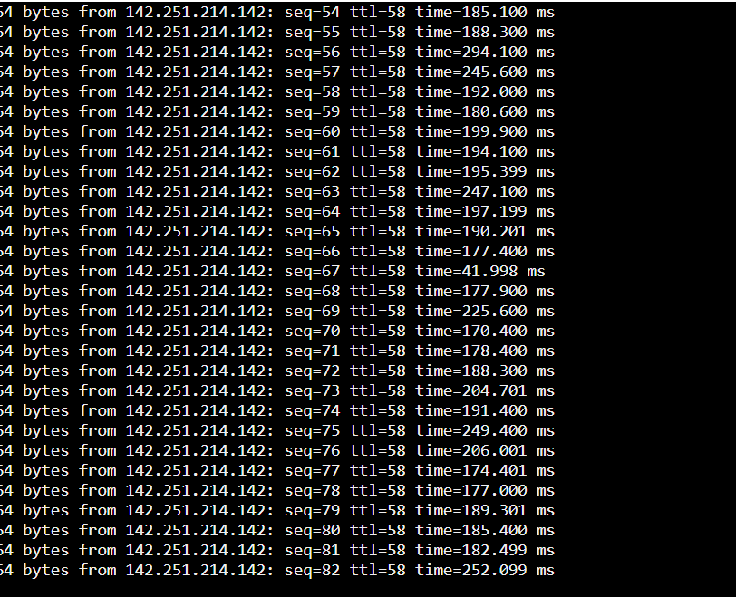

# LINUX PRACTICAL PROJECT

## "sudo" command

sudo command also known as (super user do) which is one of the most important commands, can run programs using security privila

using windows to run an administrative task, a dialog box gives the option to continue, if you choose to it then performs the task.

 

## "pwd" command

pwd which is the short for print working directory, it writes the full path name of your current directory from the root directory.

## "cd" command

the cd command stands for chang directory, it changes the current directory of the terminal which by defult opens home directory

#### how to use the command 
 type cd followed by the folders name you want to find
 to move to home directory from anywhere type cd ~ 
 move two directories up from where you are type ../

 ## "ls" command

 ls command is to basically list the names and features of files and directories, it can represrnt all files and folders in a selected set of directories or just a single one.

 

 ## "CAT" command

 cat command concattenates files together, it can also print single file contents to terminals. Gives the option of previewing content in a text file without opening it.

 to run a cat command, first run the command, then the operator, then the grep and finally the keyword.

 

 ## "cp" command

 cp or copy is used to copy files and directories from one location to another.
 -R which stands forrecursive is the command used to copy the files and subdirectories from a directory which is being copied from.

 

 ## "mv" command

 mv command is used to move or rename a file directory

## "mkdir" command

mkdir or make directory as the name implies can be used to make directories

## "rmdir" command

*remove directory is a command thats used to remove empty directories

## "rm" command

rm is a command that is used to delete files

## "touch" command

touch command is a command that creates new empty files, it also can be used to change timestamps and access stamps in individual files.

## "locate" command

locate is a command that is used to find the location of directories and files on the system

## "find" command

the find command searches for files and directories based on a user given expression

## "grep" command

global search for the regular expression is a filter thatsearches for lines matching a specified pattern and print the matching lines to a standard output

## "df" command

df is used to display infirmstion about total space and available information.

## "du" command

du command displayes how much space is on a file system 

## "head" command

head command is used to show the begining of a file, it shows the first ten lines of the file.

## "tail" command

tail command is used to show the end of a file, it shows the last ten lines of a file

## "diff" command

the diffrence command compares two contents of a file line by line and displayes the parts that do not match.

## "tar" command

tar is used for saving several files into an achive file, which can later be extracted.

## "chmod" command

this is a command that is used to change the permissions of directories and files

## "ps" command

ps command displays a list of your processes thatare currently running and obtain oter information about those processes

## "uname" command

uname command is a built in utility used to display system information

## "top" command

the top commnd is used to show the active linux processes, provides a real time viev of the running system. it also identifys and terminate a process that uses too much resources

## "history" command

history command lists up to 500 peviously used commands, it gives the privilage of re using them without reentering.

## "htop" command

the Htop command displays real time information about your computers processes. this information includes howmuch CPU and memory each process is using.

## "su" command

switch user command allows you to run command as a different user, it changes the administrative account in the current log-in secession

## "echo" command

echo command is a built in command that allows users to display lines of text or stringsthat are passed as arguments.

## "man" command

used to display the the user manual of any command that can run on the terminal. it provides Name, Synopsis, Description, Option, Exit status, Return value, Errors, files, Versions, Examples, Authors, See also.

## "wget" command

wget allows you to download content directly from the terminal

## "ping" command

ping is a tool that is used to test connectivity and system availability. it involvs sending ICMP packets to a destination machine using the host name, domain or IP address.

## "kill" command

kill command is a command used to terminate a process

## "jobs" command

the jobs command reports the status of background processes that are currently running based onthe job identifier.

## "hostname" command

this command displayes the name of the current host system

## "apt-get" command

the main task is to recieve the information and packages from the authenticated source of instalation.

## "nano" command

this command opens the specified file in the nano text editor, if the file does not exist nano will creat it for you.

## "useradd & usredel"

useradd is used to create a new account while the passwd is used to add a password, only users with root privilages or sudo can run the useradd command.

