# INTRODUCTION TO GIT

What is git? git is a distributed version controled system used to track changes in source code for developing software. Multipul users can work on the same project simultaniously. The source code is free and available to everyone to modify to their specification making it one of the most common DVCS in use today. it was created in 2005.

## Functions of git

1) Colaborative development
    -branching and merging
    -pull request
2) Staging area and selective commit
    -stage changes before commit
3) Version control
    -change tracking
    -commit history
4) Security
    -cryptographic harshing
    -Immutable commits
5) Decentralization
    -distributed system
    -standalone

## GIT INSTALATION            

### *mac OS*
     -Homebrew run this command on the teriminal (brew install git)
## *Windows*
     -Git GUI, download the installer from the site, information will be given to follow
## *Linux*
     -using ubuntu or debian, run this command on the terminal
     (sudo apu update)
     (sudo apt install get)

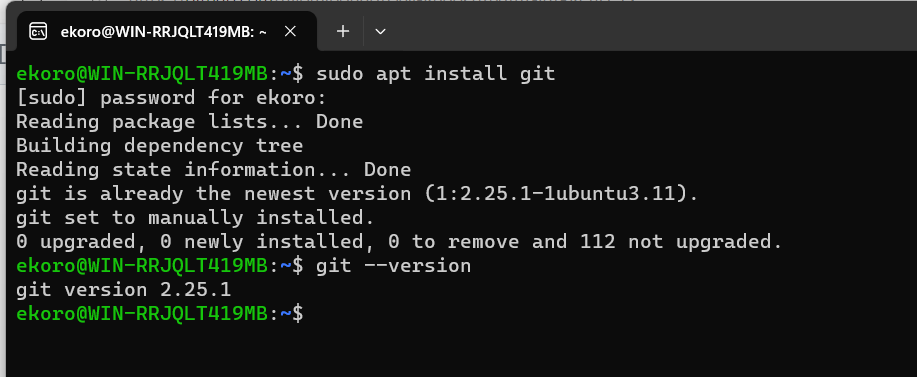

## Checking instalation
verify that git has been installed by running the following command prompt on the terminal (git --version)

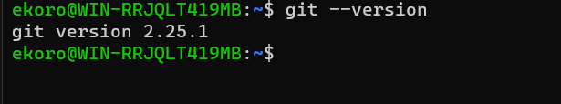

### *GIT COMMANDS*
  -git merge
  -git pull
  -git push
  -git add
  -git clone
  -git commit
  -git branch
  -git init

## Git concept

 ### *Repositories*
 mkdir DevOps, cd DevOps, git init

 

 ### *first commit*
  touch index.txt
  echo "message" >index.txt
  git add .
  git commit -m "info"

  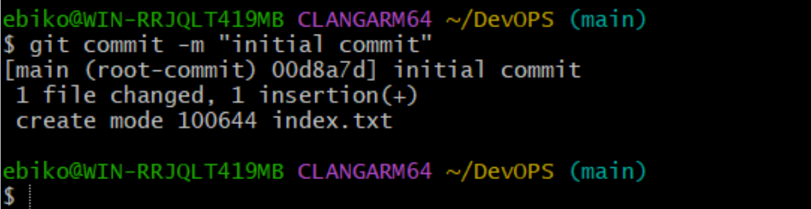

 ### *Working on branch*
 make a new branch (git checkout -b master)
 list new branch (git branch)

 

 revert back to old branch (git checkout main)

 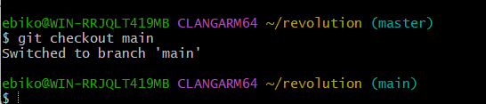

 Merging content of branch main into branch master

 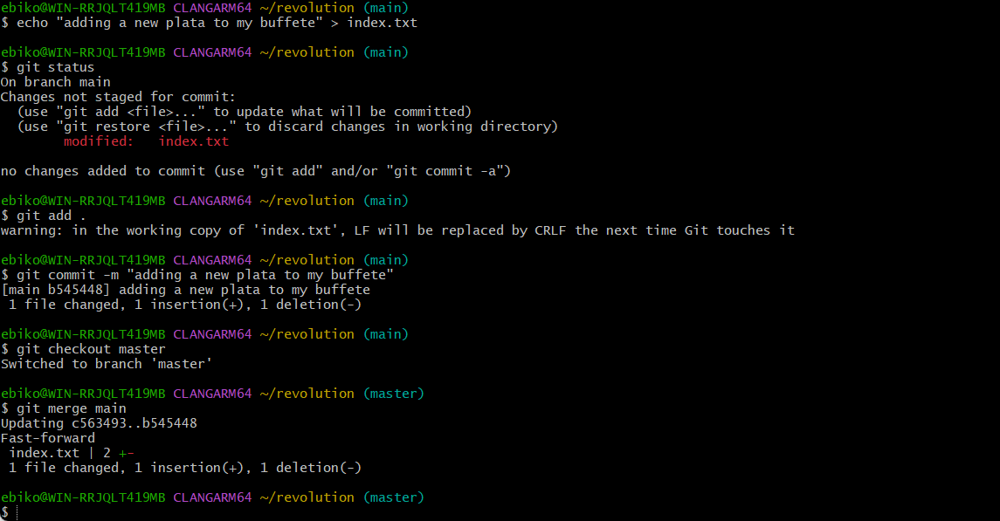

 Deleting git branch (git branch -d master)

 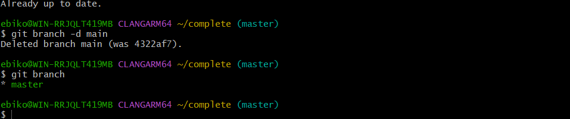

 ## CREATING A GIT ACCOUNT

 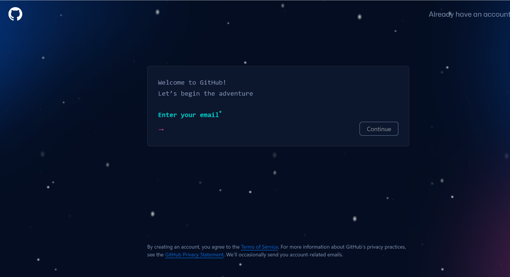

 ### *creating a new repository*
  - log into account
  - click on + icon at top right
  - select project and fill in the requirement
  - then click creat project

 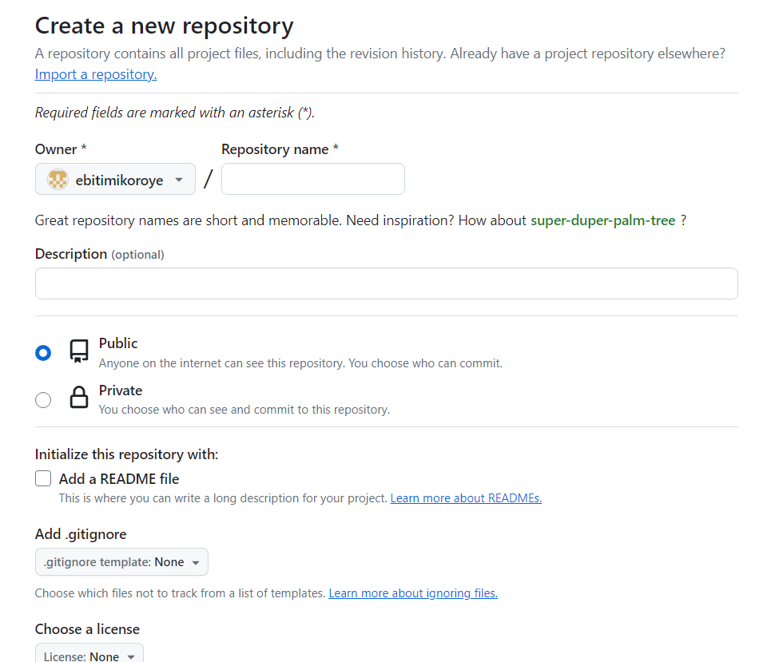

 Push your local git repository to your remote git repository

 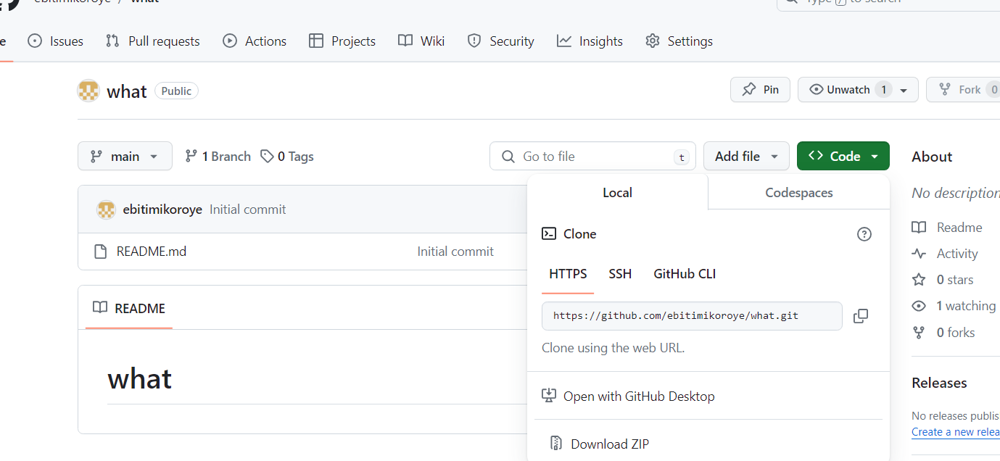

 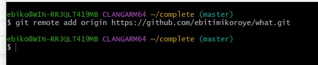

 pushing the content to remote repository
 
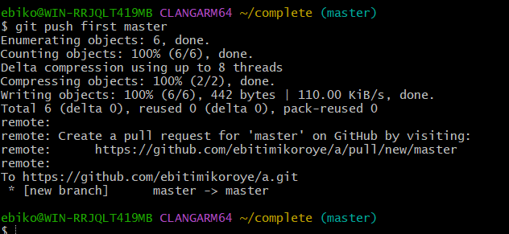

 Cloning remote git repository can be done using this git clone command (git clone<repository_url>)

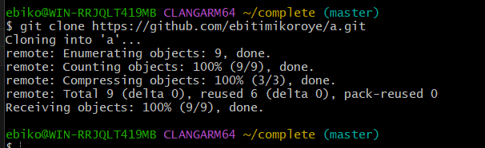
