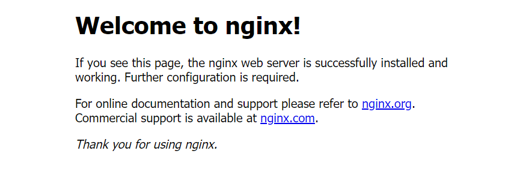
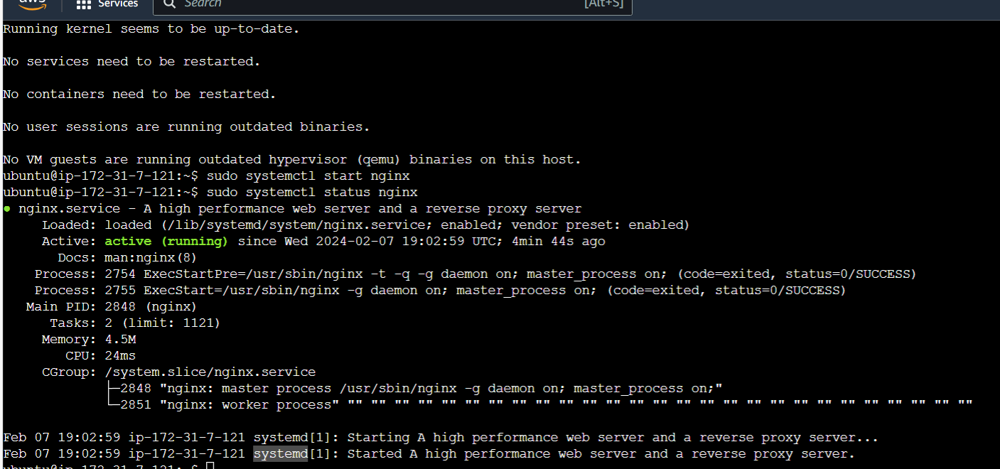
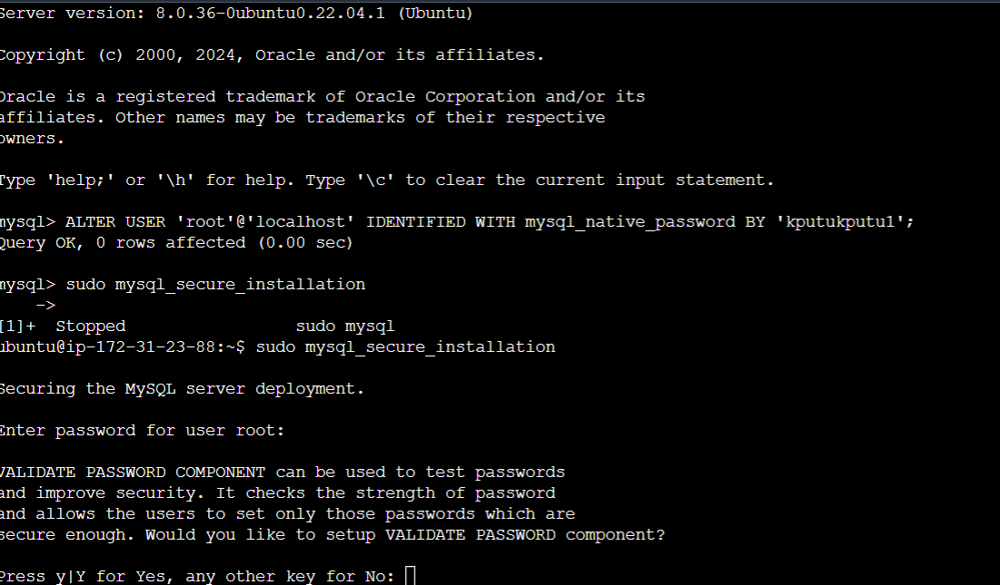

# WEB STACK IMPLIMENTATION

## Introduction to web stack

*What is web stack*, a web stack which is also known as a web application is a type of solution stack, or a compilation of software applications. it is used for performing special tasks when developing and implementing websites.

### *Some components of web stack are*
   - Operating system
   - Web server
   - Data base
   - Programing language

The operating system is the central interface between the hardware and the software components
Web wserver delivers the required documents requested for by the cliant
Database is used to store volumes of data needed for the project
The programing language provides the cliant with dynamic web application websites.

## Types of Web Stack

   - JavaScript
   - CSS
   - HTML
   - Python
   - Frameworks
   - Lemp stack

   ## LAMP STACK

   ### *What is lamp stack*? 
   it is a combination of 4 software technologies used to build websites and web application.
   - MySQL (managesa and stores data)
   - Apache (a web server that handles HTTP and deliver content to client)
   - Linux (provides the operating system)
   - PHP  (a server-side scripting language)

## WORKING WITH LEMP STACK

1) Lunch an Ubuntu Instance on AWS console and SSH into from your terminal

ssh into ubuntu Ec2 instance
   - ssh -i path/to/.pem ubuntu@public_ip address

2)  Install nginx

### Updatu local package list

   sudo apt update

### Install nginx web server

    sudo apt nginx install

#### allow firewall for apache

   sudo ufw allow "nginx HTTP"
   sudo ufw allow 22

### Confirm Nginx web server is installed

   sudo systemctl status nginx

    

## Installing mysql

 MySql is a cliant/server system that consists of a multithreaded SQL server that supports different back ends. several different cliant programs and libraries, administrative tools, and a wide rang of application-programimng interface

here are the commands used to setup MySqlserver on aws ec2

   - update the system
      "sudo apt update"
   - Install MySql
      "sudo apt install mysql-server
   - check status
      "sudo systemctl status mysql
   - login as root user
      "sudo mysql
   - Update password
      "ALTER USER "root"@"localhost" IDENTIFIED WIH mysql native password BY "insert password";

