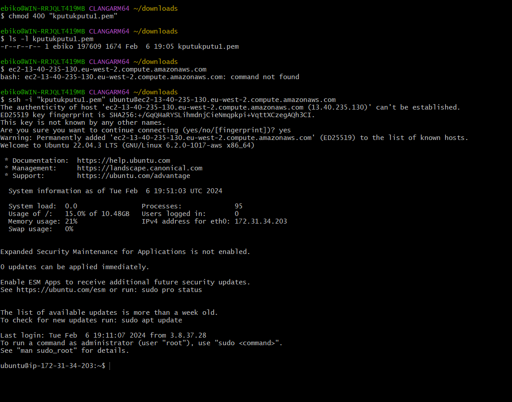
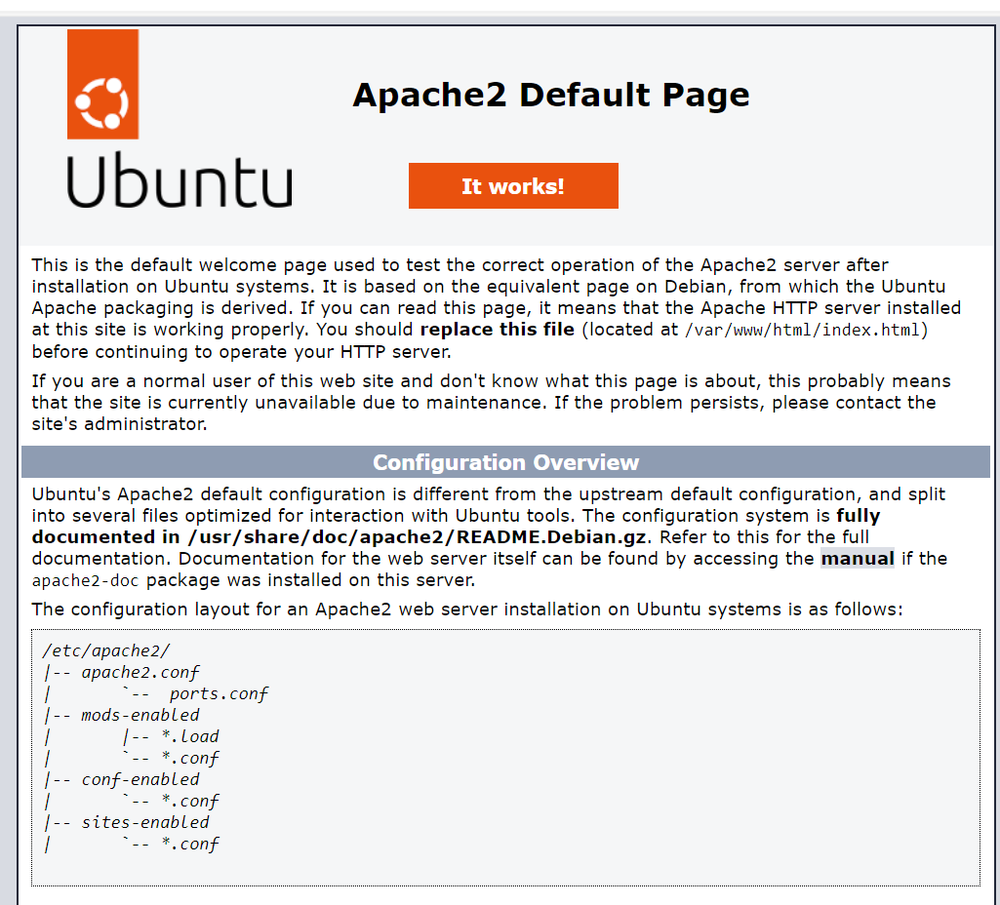
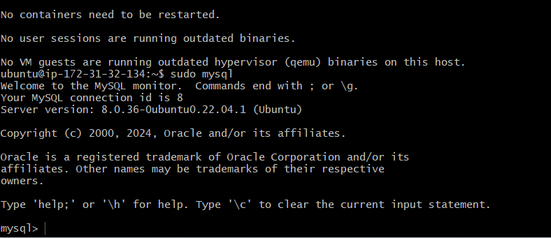
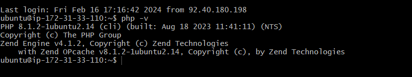
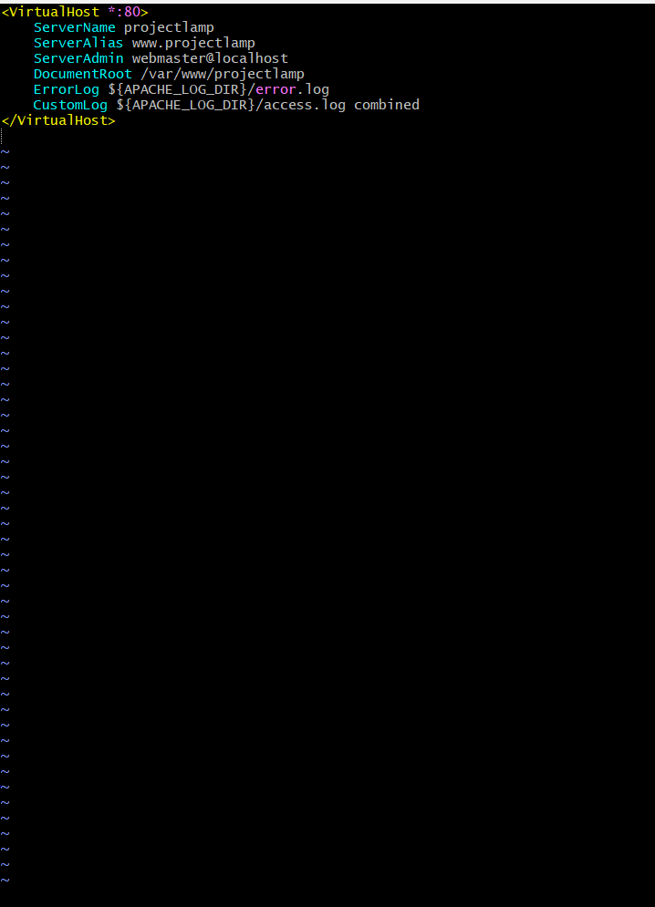
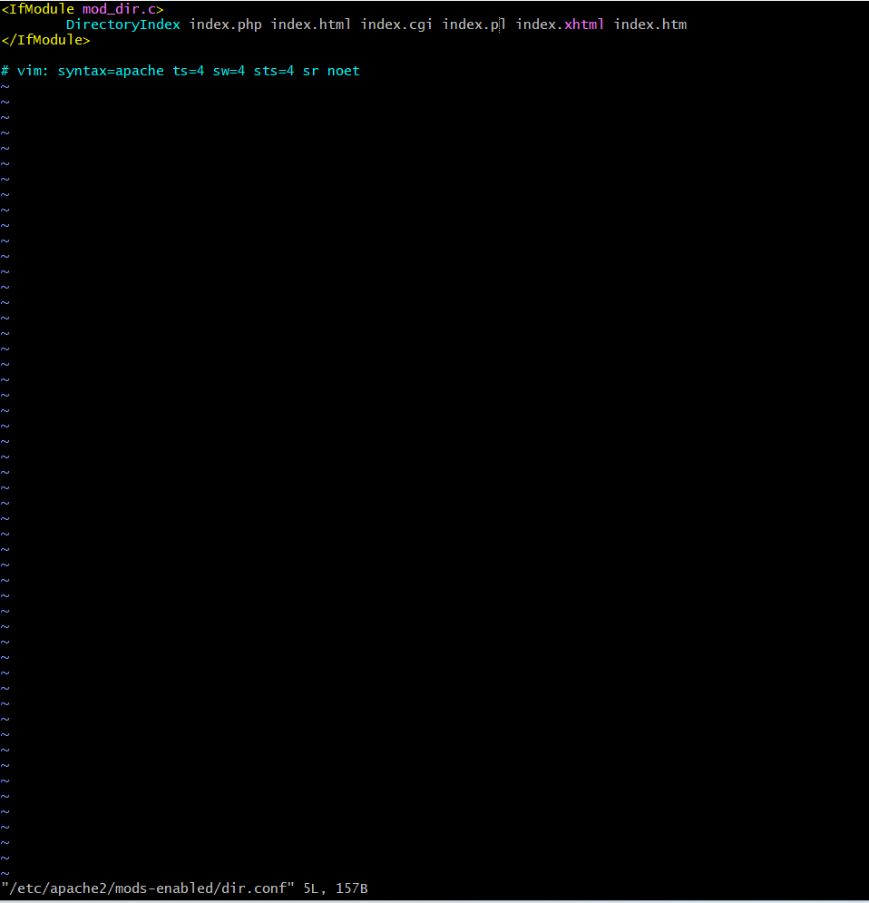
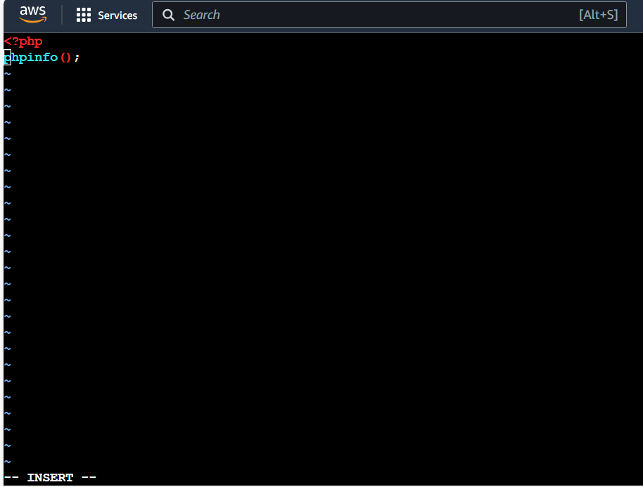
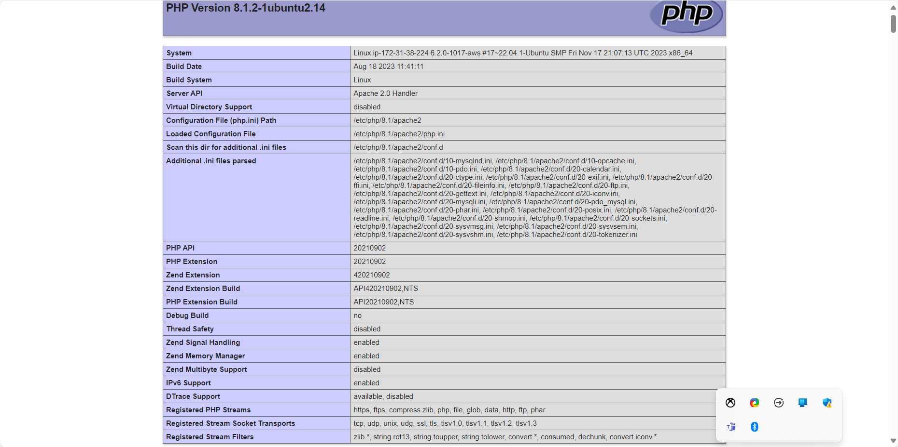

# WEB STACK IMPLIMENTATION

## Introduction to web stack

*What is web stack*, a web stack which is also known as a web application is a type of solution stack, or a compilation of software applications. it is used for performing special tasks when developing and implementing websites.

### *Some components of web stack are*
   - Operating system
   - Web server
   - Data base
   - Programing language

The operating system is the central interface between the hardware and the software components
Web wserver delivers the required documents requested for by the cliant
Database is used to store volumes of data needed for the project
The programing language provides the cliant with dynamic web application websites.

## Types of Web Stack

   - JavaScript
   - CSS
   - HTML
   - Python
   - Frameworks
   - Lemp stack

   ## LAMP STACK

   ### *What is lamp stack*? 
   it is a combination of 4 software technologies used to build websites and web application.
   - MySQL (managesa and stores data)
   - Apache (a web server that handles HTTP and deliver content to client)
   - Linux (provides the operating system)
   - PHP  (a server-side scripting language)

## WORKING WITH LEMP STACK

1) Lunch an Ubuntu Instance on AWS console and SSH into from your terminal

ssh into ubuntu Ec2 instance
   - ssh -i path/to/.pem ubuntu@public_ip address

2)  Install Apache2

### Update local package list

it is important to first update the server, and if there are any upgrades required, they also should be attended to. the commands needed are
  - sudo apt update
  - sudo apt upgrade

### Install Apache2 web server

What is apache2 ? it is a free and open-source cross-platform web server software, it is responsible for accepting HTTP requests from visitors and sending them back the requested information in the form of web pages or in simpiler terms. it allows visitors to view content on your website. the command used to install apache2 is,
  - sudo apt install apache2

once the installation is done, you can confirm if it is up and running by running this command,
  - sudo systemctl status apache2

At this point you can test to see if your ip adderess is functional by opening a web page of choice and type in the ip adderess
- http://public ip address:80

this should be the result you get after searching the web using your IP adderess

## Installing mysql

 MySql is a cliant/server system that consists of a multithreaded SQL server that supports different back ends. several different cliant programs and libraries, administrative tools, and a wide rang of application-programimng interface

here are the commands used to setup MySqlserver on aws ec2

   - update the system
      "sudo apt update"
   - Install MySql
      "sudo apt install mysql-server
   - check status
      "sudo systemctl status mysql
   - login as root user
      "sudo mysql
   - Update password
      "ALTER USER "root"@"localhost" IDENTIFIED WIH mysql native password BY "insert password";

   

## Installing PHP

First of what really is php? it isa general purpose scripting language geared towards web development. It was originally created in 1993 and released in 1995. it is used in various veb applications like e-commerce websites to crm systems like hubspot and salesforce

install php-fpm, and tell apache2 to pass PHP requests to this software for processing. then we need php-mysql to communicate with MySQL-based databases. Core PHP packages will automatically be installed as dependencies.

    sudo apt install php-fpm php-mysql -y

To confirm the version of php, run this command
 - php -v

 

   Configuring apache2 to Use PHP Processor

configuring apache2 to use PHP as a processor, set up the FastCGI process manager (PHP-FPM) then configure apache2 to send PHP requests to PHP-FPM.
create a folder called projectlemp for our webserver. Create the root web directory for your_domain in /var/www/ folder as follows:
 - sudo mkdir /var/www/projectlemp

Next, assign ownership of the directory with the $USER environment variable, which will reference your current system user:
-  $ sudo chown -R $USER:$USER /var/www/projectLEMP

Open a new configuration file in sites-available directory
- $ sudo vi /etc/apache2/sites-available/projectlamp.conf

 After editing, save and close the file. to achieve that, (esc- then : then -w q then enter)

use this command to show the available directory
 - $ sudo ls /etc/apache2/sites-available
You will see something like this
000-default.conf  default-ssl.conf  projectlamp.conf

use the following command to enable the virtualhost
 - $ sudo a2ensite projectlamp

disable the config file that comes with apache2
 - $ sudo a2dissite 000-default

to ensure there are no syntax error on your config use the following command
 - $ sudo apache2ctl configtest

reload apache2 so all the changes will take effect
 - $ sudo systemctl reload apache2

 - sudo echo 'Hello LAMP from hostname' $(curl -s http://169.254.169.254/latest/meta-data/public-hostname) 'with public IP' $(curl -s http://169.254.169.254/latest/meta-data/public-ipv4) > /var/www/projectlamp/index.html

## php, nginx, mysql

 at this point have been installed sucessfully.

### Create a virtual host for the website using apache2

With the defult directory index setting on apache2, a file name "index.html" will always take precedence over index.php, if you want to change this you need to use this connand
 - sudo vim /etc/apache2/mods-enabled/dir.conf

<IfModule mod_dir.c>
        #Change this:
        #DirectoryIndex index.html index.cgi index.pl index.php index.xhtml index.htm
        #To this:
        DirectoryIndex index.php index.html index.cgi index.pl index.xhtml index.htm
</IfModule>

after editing, save and reload

 - $ sudo systemctl reload apache2

 now that we have a custon location to host our website files and folders, lets create a php script to test if it can handle and process request from php files
 create a new file named index.php inside your custome web root folder
  -  $ vim /var/www/projectlamp/index.php

   Testing apache2 With PHP

we can do this by creating a test PHP file in our document root. let's open a new file called info.php:

save and exit. you will have this if you refresh your page.

after confirming that the process is sucessful, its best to remove the file as it containes sensitive details about your php
 - $ sudo rm /var/www/projectlamp/index.php

