# WEB STACK IMPLIMENTATION (LAMP STACK)

First of, what is web stack? it is the collection of software used for web development that incoperates, at a minimum, an operating system (OS), a programming language, database software and aweb server. it is also a type of solution stack.
There are different web servers that can be used to implement a web stack

## Types of Web Stack

  - Nginx
  - Apache tomcat
  - Lighttpd
  - Jetty
  - Caddy

This project will be done using a number of tools such as 
Nginx, Git bash, AWS,

First step is to install the various tools, then open your git bash terminal,next CD downloads and run this command to switch from your local host
ssh -i <Your-private-key.pem> ubuntu@<EC2-Public-IP-address>

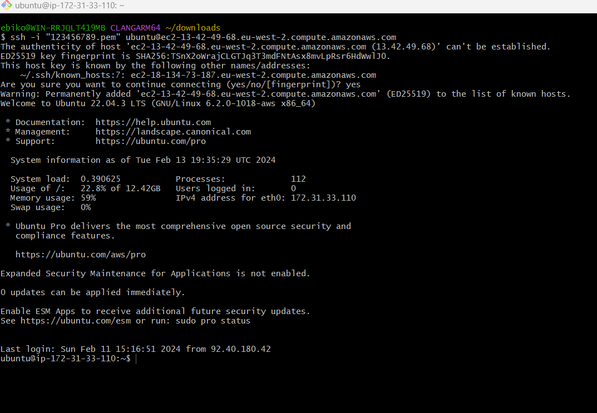

## Installing NGINX Web server

NGINX is an opensource high performance HTTP server and reverse proxy, loadbalancing and caching. It provides HTTPS server capabilities and is mainly designed for maximum performance and stability, it also functions as a proxy server for email communicationsproctocols such as, IMAP, POP3 and SMTP.

Installing nginx can be done using this command

- sudo apt update
- sudo apt install nginx

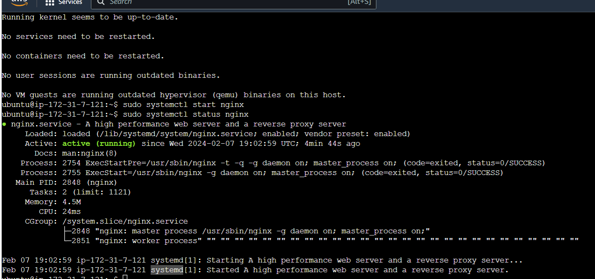

to check the installation suceeded and to know the status, use this command
- sudo systemctl status nginx

OPpen a TCP port 80. to achieve this we will have to use our EC2 on our aws, by defult we have TCP port 22 running on our EC2, we will have to add a rule to the configuration to open inbound connection through port 80

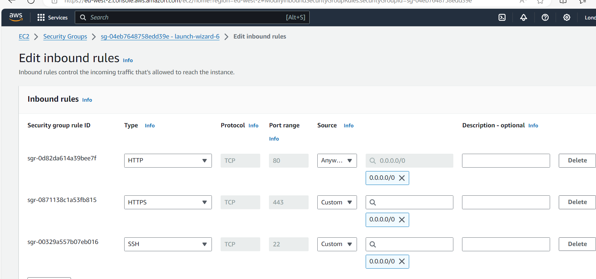

once this is done, we will need to test to see how it will respond to request from the internet,
to confirm this run the following command

http://<Public-IP-Address>:80
curl -s http://169.254.169.254/latest/meta-data/public-ipv4
 
both commands practically do thesame thing

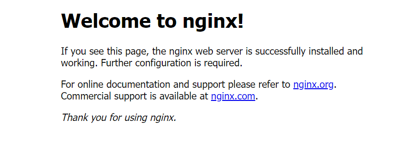

## Installing MYSQL

Installing mysql which is a client/server system that consist of a multithreaded SQL server that supports different back ends, several client programs and libraries, administrative tools and a whole range of applications-programining interfaces.

the command used to install mysql
- $ sudo apt install mysql-server

after instalation, the command used to log into it is
- $ sudo mysql

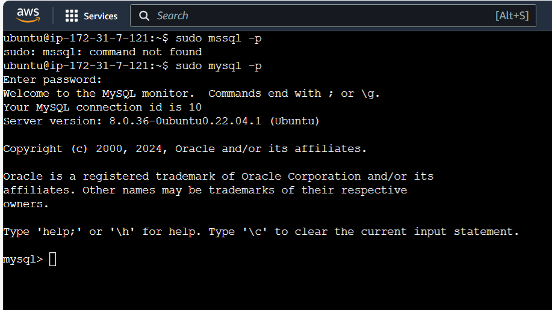

Running a security script that comes pre-installed will remove some insecure defult settings.first setup a password using this command
- ALTER USER 'root'@'localhost' IDENTIFIED WITH mysql_native_password BY 'PassWord.1';

After following the process of instalation, you can test if you are able to log into mysql by running this command, password will be required.
- $ sudo mysql -p

After login is successful, its time to logout, to achieve that, run the following command 
- mysql> exit

## INSTALLING PHP

PHP will be installed to process codes and generate dynamic content for the web server. two installations will come in handy 
 - PHP-PFM
 - PHP-MYSQL

 To run both instalations at once run this command
 -  $ sudo apt install php-fpm php-mysql

After installing both php-pfm and php-mysql, you will then configure nginx to use php processor.

## CONFIGURING NGINX TO USE PHP PROCESSOR

We can use NGINX to create server blocks to encapsulate configration details and host more than one domain on a single server. By defult, nginx 20.04 has one server block /var/www/html. it is difficult using it to host multiple sites, lets create a drictory structure within www/html.

To achieve that we will use this command
 - $ sudo mkdir /var/www/projectLEMP

next is to assigne ownership of the directory using this command
 - $ sudo chown -R $USER:$USER /var/www/projectLEMP

use this command to open a new configration file in NGINX
 - $ sudo nano /etc/nginx/sites-available/projectLEMP

after the blank file has been created, impute the following into the file.

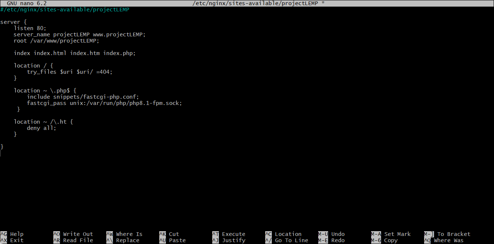

Once that is concluded, save and close the file, if you are using nano " ctrl + X and then use Y and then enter.

Activate your configuration by linking your config to nginx sites enabled directory using this command
- $ sudo ln -s /etc/nginx/sites-available/projectLEMP /etc/nginx/sites-enabled/

test your configuration for syntex error using this command
 - $ sudo nginx -t

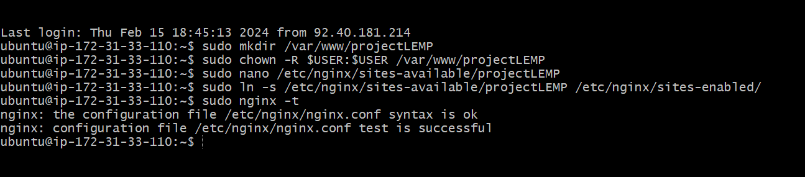

Next is to disable and then reload to apply changes to NGINX Uusing these commands
 - sudo unlink /etc/nginx/sites-enabled/default
 - $ sudo systemctl reload nginx

Once reload is done, your new website has been activated but the web root is empty. we eill create a HTML file to test if the server block is operational.

 - sudo echo 'Hello LEMP from hostname' $(curl -s http://169.254.169.254/latest/meta-data/public-hostname) 'with public IP' $(curl -s http://169.254.169.254/latest/meta-data/public-ipv4) > /var/www/projectLEMP/index.html

after editing our file, lets go to a web browser of our choice and search our public IP. 
 - http://<Public-IP-Address>:80
 
You can tell Nginx is fully functional if you see the text from "echo" command, leave the file as a temporary loading page  for your application untill you replace it with an index.php. dont forget to remove or rename the index.html from your document root or it will take precedence over an index.php.

## Testing PHP with NGINX

Your LEMP stack setup should now be completed. to know if NGINX can correctly hand PHP files off to your PHP processor.

First create a test PHP file in your root document, open a new file called "info.php" in your text editor. 
 
 use this command 
  - $ nano /var/www/projectLEMP/info.php

  type this line in the new file, its a valid PHP code that will return information about your server.

   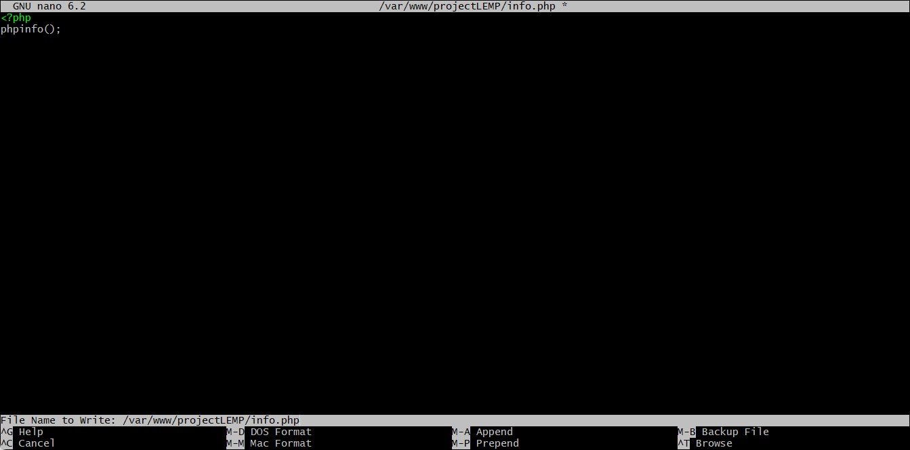 

save and exit it, you wll be able to access this page through your browser.
 http://`server_domain_or_IP`/info.php

 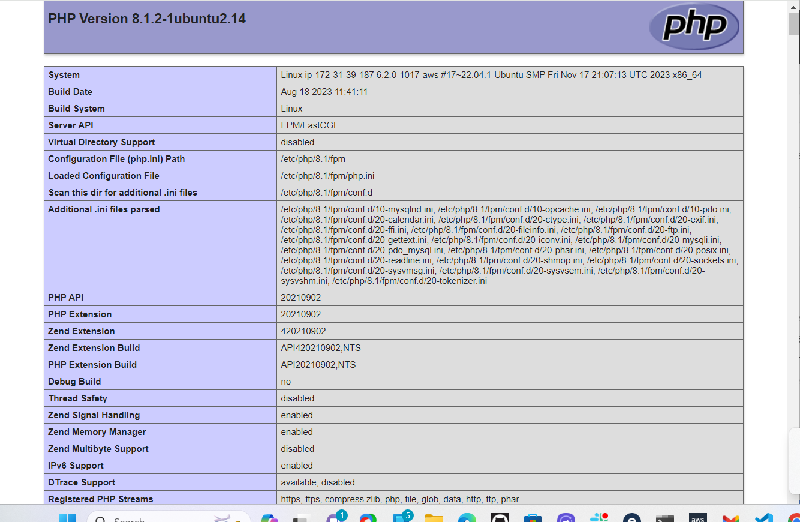
 
it will be a web page containing your server details, make sure you remove it as it contains sensitive information

 - $ sudo rm /var/www/your_domain/info.php
you can use this command to regenerate this file anytime.

## Using PHP To Retrive Data From MySQL

Create a test data base with a simple "to do list" then configure access to it. so the Nginx website would be able to query data from the database and display it.

Create a database and give it a name, also create a user and give a name,
 
First connect to MySQL console using the root account
 - $ sudo mysql

next create a database from MySQL console
 - mysql> CREATE DATABASE `example_database`;

cret a new user and grant full privilages on the data base
 - mysql>  CREATE USER 'example_user'@'%' IDENTIFIED WITH mysql_native_password BY 'PassWord.1';

ensure to replace the password with a mor secured one.

the next is to give the new user permission over the database, using this command will give the user full access to database without being able to create or modify other database on the server.
 - mysql> GRANT ALL ON example_database.* TO 'example_user'@'%';

exit the MySQL shell
 - mysql> exit

test the new user has access to the database by logging in with the password created. to achieve that use this command.
 - $ mysql -u example_user -p

the -p flag will prompt you for the new user password, confirm you have access to the database using this command.
 - mysql> SHOW DATABASE

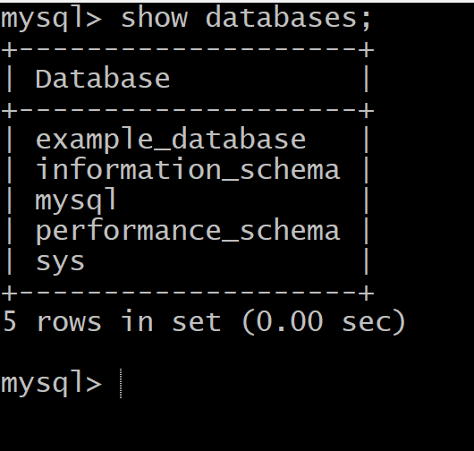

Create a test table named TODO_LIST using the MySQL console, insert a few rows of content, impute the following statement.
 - CREATE TABLE example_database.todo_list (item_id INT AUTO_INCREMENT,content VARCHAR(255),PRIMARY KEY(item_id));

 - mysql> INSERT INTO example_database.todo_list (content) VALUES ("My first important item");

confirm the data issaved to your table, use the following command
 - mysql>  SELECT * FROM example_database.todo_list;

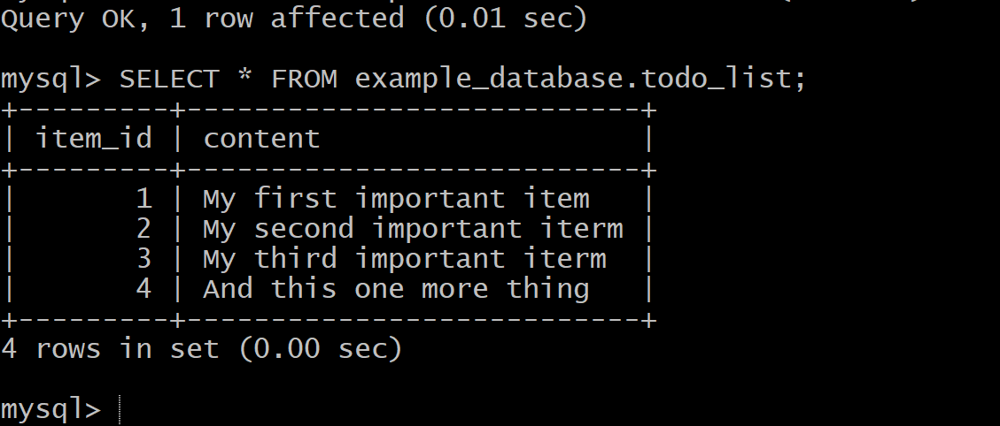

once you get the confirmation of the data on the test table you can exit.
 - mysql> exit

Create a PHP script that will connect to MySQL and query for your content. Create a new PHP file in your custom web root directory using your preferred editor.
 - $ nano /var/www/projectLEMP/todo_list.php

next copy this content into your todo_list script, after that save and close the file

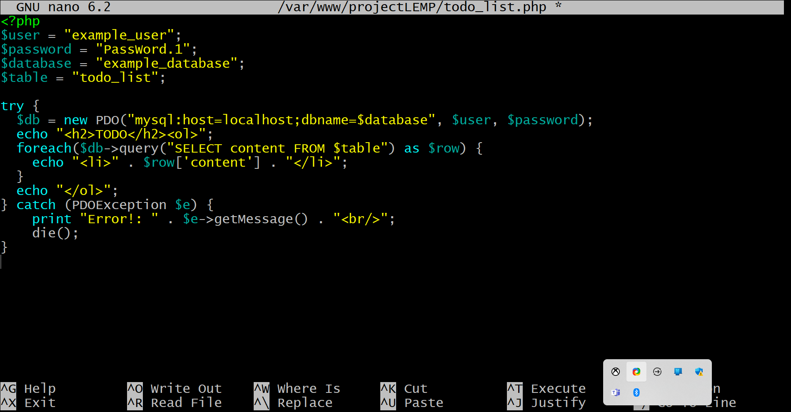

Once that is done, you can access the page on your web browser.

- http://<Public_domain_or_IP>/todo_list.php

