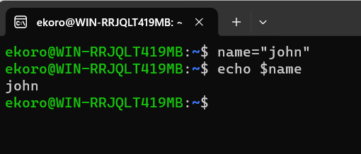
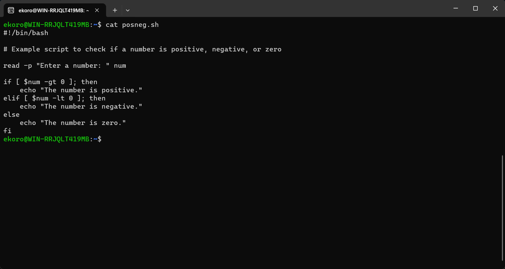
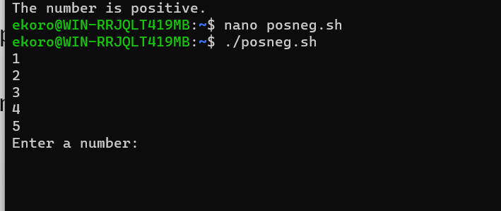

# INTRADUCTION TO SHELL SCRIPTING AND USER INPUT

## What is shell scripting

A shell script is a text file that contains a sequence of commands for a UNIX-based operating system. It's called a shell script because it has a sequence of commands, that will have to be typed in individually into a single script. The shell is the operating system's command-line interface (CLI) and interpreter for a set of commands which are used to interact with the system.

A shell script is usually created for command sequences in which a user has a need to use repeatedly in order to save time. Like other programs, shell script  contain's parameters, comments and sub-commands which the shell has to follow. Users initiate the sequence of commands in the shell script by simply entering the file name on a command line.

### How shell scripting works

 Basic steps in shell scripting are 
  - writing the script.
  - making the script accessible to the shell.
  - giving the shell execute permission.

Shell scripts contain ASCII text and are written using 
 - text editor.
 -  word processor.
 -  graphical user interface (GUI). 
 
 The content of the script is a series of commands in a language that can be interpreted by the shell. Functions that shell scripts support include loops, variables, if/then/else statements, arrays and shortcuts. Once complete, the file is saved typically with a .txt or .sh extension and in a location that the shell can access.

 ## Shell scripting syntax elements
  
  1) Variables- it is a fundamental concept in shell scripting that allow's you to store and config data. In a shell script, a variable is a container that holds a value, such as,
   - string.
   - number.
   - file path.

lets assign a value to a variable using this command
 - $ name="john"

lets retrive the value from yhe variable using this command
 - $ echo $name

  2) controle flow- shell scrit provides various commands that can be used to control the flow of execution in a program. eg

  - if
  - test
  - exit
the various commands in the capture bellow shows us how using if-else can execute a script.

Now let's try to run some numbere to see how it works.

this will be the result
