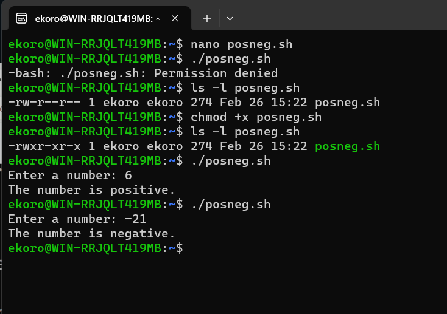
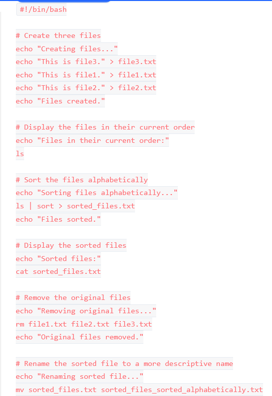

# INTRADUCTION TO SHELL SCRIPTING AND USER INPUT

## What is shell scripting

A shell script is a text file that contains a sequence of commands for a UNIX-based operating system. It's called a shell script because it has a sequence of commands, that will have to be typed in individually into a single script. The shell is the operating system's command-line interface (CLI) and interpreter for a set of commands which are used to interact with the system.

A shell script is usually created for command sequences in which a user has a need to use repeatedly in order to save time. Like other programs, shell script  contain's parameters, comments and sub-commands which the shell has to follow. Users initiate the sequence of commands in the shell script by simply entering the file name on a command line.

### How shell scripting works

 Basic steps in shell scripting are 
  - writing the script.
  - making the script accessible to the shell.
  - giving the shell execute permission.

Shell scripts contain ASCII text and are written using 
 - text editor.
 -  word processor.
 -  graphical user interface (GUI). 
 
 The content of the script is a series of commands in a language that can be interpreted by the shell. Functions that shell scripts support include loops, variables, if/then/else statements, arrays and shortcuts. Once complete, the file is saved typically with a .txt or .sh extension and in a location that the shell can access.

 ## Shell scripting syntax elements
  
  1) Variables- it is a fundamental concept in shell scripting that allow's you to store and config data. In a shell script, a variable is a container that holds a value, such as,
   - string.
   - number.
   - file path.

lets assign a value to a variable using this command
 - $ name="john"

lets retrive the value from yhe variable using this command
 - $ echo $name

  2) controle flow- shell scrit provides various commands that can be used to control the flow of execution in a program. eg

  - if
  - test
  - exit

the various commands in the capture bellow shows us how using if-else can execute a script.

Now let's try to run some numbere to see how it works.

this will be the result

  3) Command substitution- it allows you capture the output of a command as an argument to another command. When you place a command line within backquotes ( `` ), the shell runs the command then replaces the entire expression, including the backquotes, with the output.

use backtick for command substitution

 - current_date=`date +%Y-%m-%d`

use $() syntax for command substution

 - current_date=$(date +%Y-%m-%d)

  4) In an interactive shell, or a script running on a terminal, the Standard Input is how bash sees the characters you type on your keyboard. The Standard Output is where the program sends most of its normal information so that the user can see it, and the Standard Error is where the program sends its error messages.

Example of user inpute

 - echo "Enter your name:"
read name

Example of output text to the terminal

 - echo "Hello World"

Example the result of a command into a file

 - echo "hello world" > index.txt

Example pass the result of a command as input to another command

 - echo "hello world" | grep "pattern"

  5) functions are blocks of code that can be used multiple times within or across different scripts. A function in shell scripting is similar to a subroutine or function in other programming languages.

## Lets write our first script

 First make a directory, then open a file inside the directory, then paste the following in the file, next save the file, after that make the file executable and finally run he script.

 1) - mkdir shell-scripting
 
 2) - touch user-input.sh
 
 3) - 
      

 4) - ctrl + X then Y and ENTER

 5) - chmod +x user-input.sh

 6) - ./user-input.sh

## Directory manipulation and navigation

in this script we will create a file, paste the following in the file, set execute permission on the file finally run the script.

1) - touch navigating-linux-filesystem.sh

2) - 
    

3) - chmod +x navigating-linux-filesystem.sh

4) - ./navigating-linux-filesystem.sh

## File Operations and Sorting

1) - touch sorting.sh

2) - 
   

3) - chmod +x sorting.sh

4) - ./sorting.sh

## Working with Numbers and Calculations

 1) - touch calculations.sh

 2) - 
    

 3) - chmod +x calculations.sh

 4) - ./calculations.sh

 

## File Backup and Time Stamping

1) - touch backup.sh

2) -
    

3) - chmod +x backup.sh

4) - ./backup.sh

