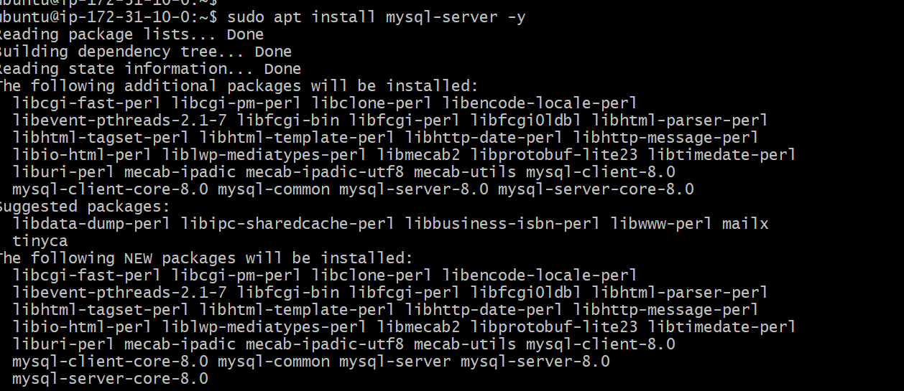
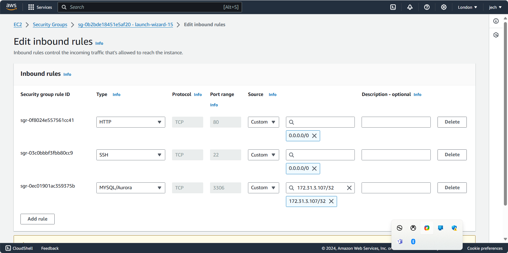
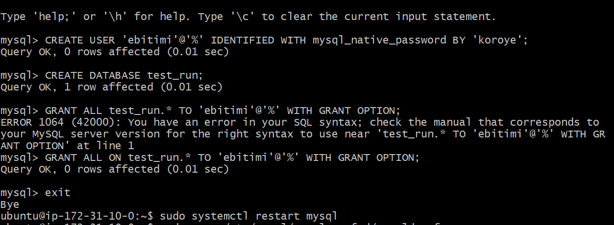
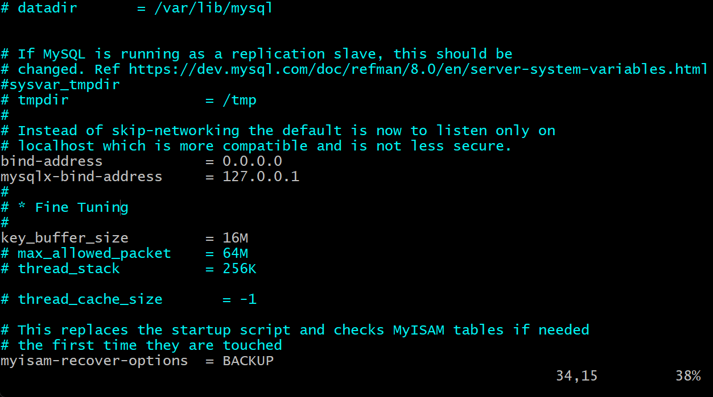
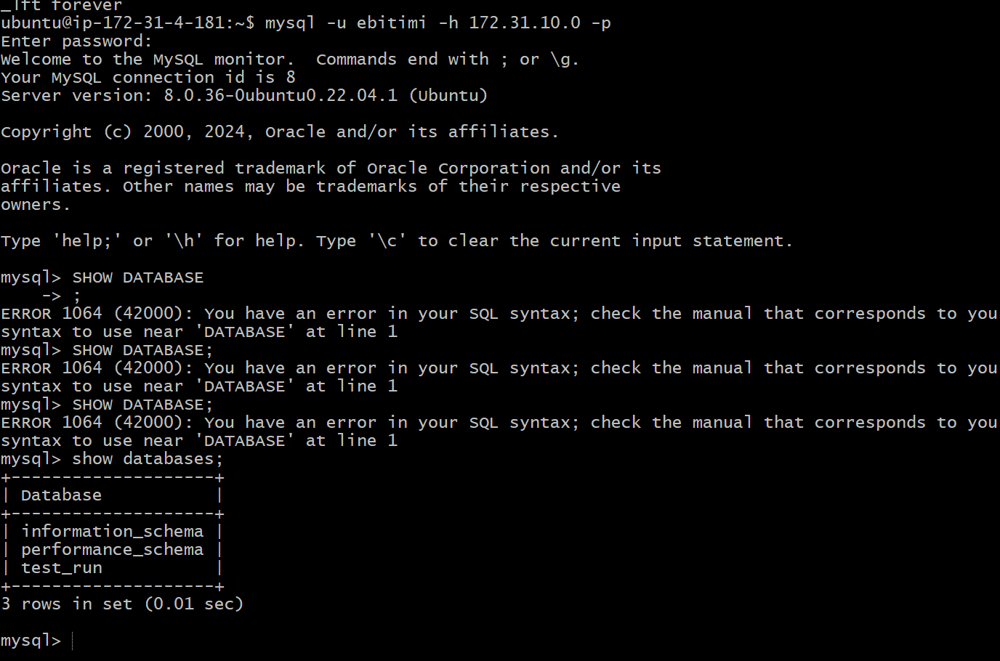

# Understanding Client Server Architecture With MySQL As RDBMS

## Introduction

 What is client-server architecture?

it's a computing model that divides the functionality of a system into two distinct roles: clients and servers. The client-server architecture refers to a system that hosts, delivers, and manages most of the resources and services that the client requests.    Requests and services are delivered over a network, and it is also referred to as the networking computing model or client server network. Alternatively called a client-server model, is a network application that breaks down tasks and workloads between clients and servers that reside on the same system or are linked by a computer network.

Client-server architecture typically features multiple users’ workstations, PCs, or other devices, connected to a central server via an Internet connection or other network. The client sends a request for data, and the server accepts and accommodates the request, sending the data packets back to the user who needs them. 

## Prerequisites

1 - Basic knowledge of at least one programming language.

2 - A server infrastructure to host the MySQL server and the client application.

3 - Familiarity with SQL.

4 - Know t basic Linux commands and knowledge of Linux server management

5 - Install and set up MySQL on your Linux server.

a quick example of client server

## Deploying a Client-Server using MySQL

Follow the below steps to implement a basic client-server architecture using MySQL RDBMS.

Create and configure two Linux-based virtual servers (EC2 instances in AWS). This involves creating two security groups that allow SSH connections on port 22. These instances will be launched in the default VPC. 

## Implementing MySQL as a Client Server Architecture

Step 1: Launch 2 EC2 Instances on AWS

i. Each instance should be named

Instance 1 - mysql server

Instance 2 - mysql client

ii. Open 2 terminals and ssh into both "mysql server" "mysql client"

For windows users, open command prompt, powershell or git bash
For mac and linux users, open a terminal and ssh into the instance

Step 2: Updating and Upgrading Package Lists and Apt Repositories
On both mysql server and mysql client update and upgrade package lists

sudo apt update -y && sudo apt upgrade -y
Note: The command above should be executed for mysql server and mysql client instances

Step 3: Installing MySQL Server Software
On mysql server instance install MySQL Server software.

sudo apt install mysql-server -y

Step 4: Allowing Access To MySQL Server for MySQl Client

By default, both of your EC2 virtual servers are located in the same local virtual network, so they can communicate to each other using local IP addresses. Or, you can add them to the same subnets.
Use mysql server's local IP address to connect from mysql client. MySQL server uses TCP port 3306 by default, so you will have to open it by creating a new entry in ‘Inbound rules’ in ‘mysql server’ Security Groups. For extra security, do not allow all IP addresses to reach your ‘mysql server’ – allow access only to the specific local IP address of your ‘mysql client’.

Step 5: Create A New User and Database On MySQL Server In order for mysql client to be able to send request to mysql server, we need to create a new user for mysql client and a database.

i. Login to mysql server

sudo mysql

ii. Create a new user

mysql>  CREATE USER 'example_user'@'%' IDENTIFIED WITH mysql_native_password BY 'PassWord.1';

Note: The password field should be replaced wih your password

iii. Create a database

CREATE DATABASE example_database;

Step 6: Grant MySQL Client Administrative Prilvledges

i. Grant privileges

  mysql> GRANT ALL ON example_database.* TO 'example_user'@'%';

Exit MySQL and restart the mySQL service using

sudo systemctl restart mysql

Step 7: Configure MySQL server to Allow Connections From Remote Hosts. 

i. Edit mysql server configuration file

sudo nano /etc/mysql/mysql.conf.d/mysqld.cnf

In the mysqlserver configuration file, replace 127.0.0.1’ to ‘0.0.0.0, then save and close the file

Step 8: Connecting To Mysql Server From Mysql Client 

i. Connect to mysql server from mysql client

mysql -u example_user -h <mysql_server_ privateipaddress> -p password

ii. Check that you have successfully connected to a remote MySQL server and can perform SQL queries

Client connection to mysql

show databases;

