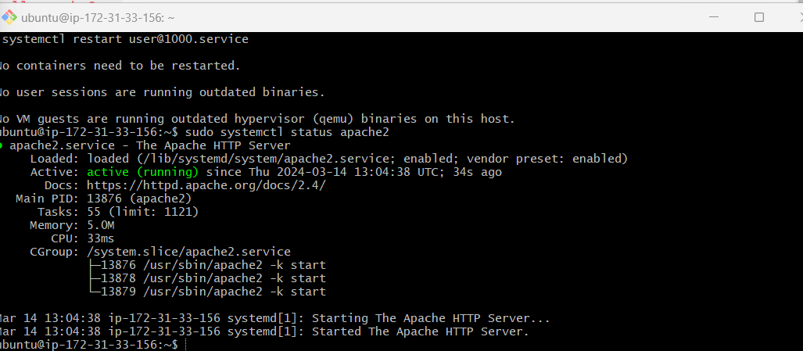
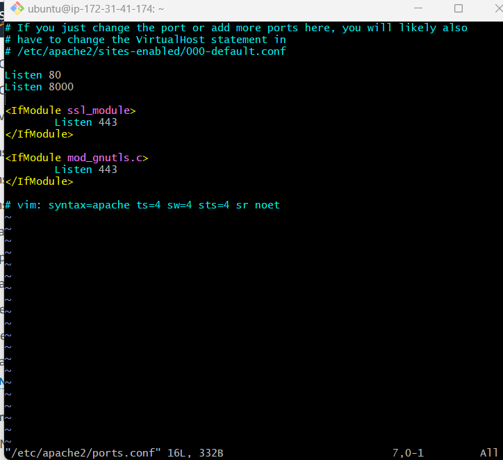
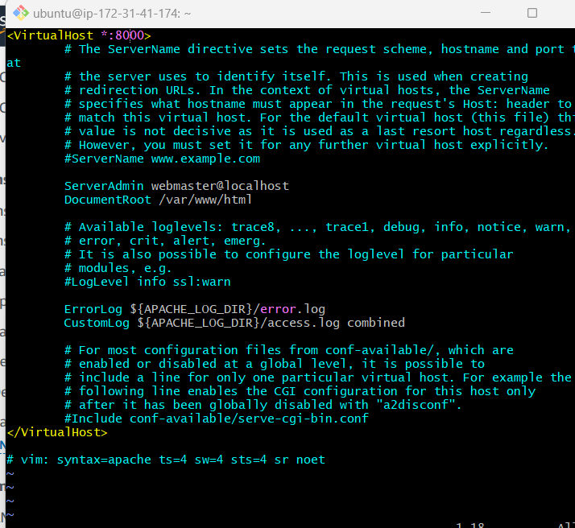
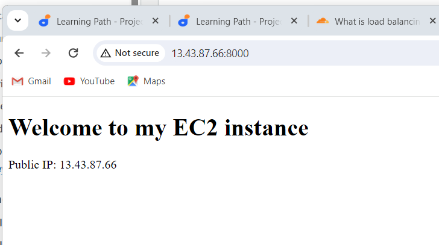
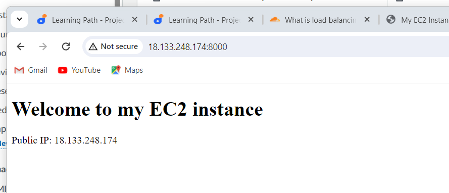
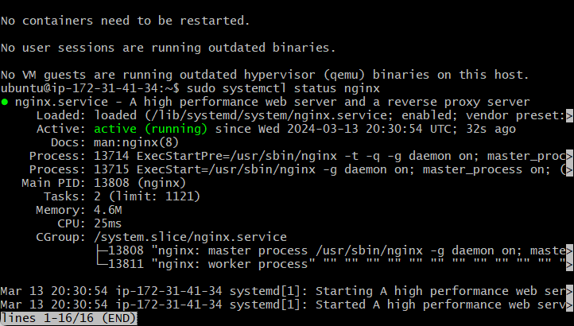
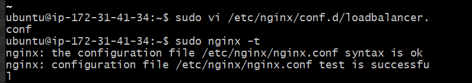
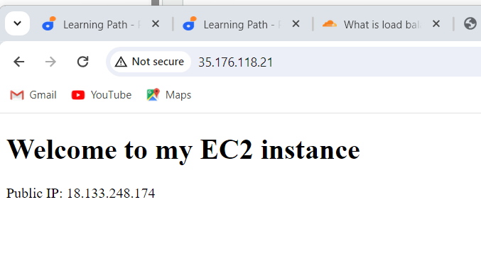

# IMPLEMENTING LOAD BALANCING WITH NGINX

## What is load balancing

Load balancing is the practice of distributing computational workloads between two or more computers. On the Internet, load balancing is often employed to divide network traffic among several servers. This reduces the strain on each server and makes the servers more efficient, speeding up performance and reducing latency. Load balancing is essential for most Internet applications to function properly.

Imagine a checkout line at a grocery store with 8 checkout lines, only one of which is open. All customers must get into the same line, and therefore it takes a long time for a customer to finish paying for their groceries. Now imagine that the store instead opens all 8 checkout lines. In this case, the wait time for customers is about 8 times shorter (depending on factors like how much food each customer is buying).

Load balancing essentially accomplishes the same thing. By dividing user requests among multiple servers, user wait time is vastly cut down. This results in a better user experience — the grocery store customers in the example above would probably look for a more efficient grocery store if they always experienced long wait times.

## How does it work 

Load balancing is handled by a tool or application called a load balancer. A load balancer can be either hardware-based or software-based. Hardware load balancers require the installation of a dedicated load balancing device; software-based load balancers can run on a server, on a virtual machine, or in the cloud. Content delivery networks (CDN) often include load balancing features.

When a request arrives from a user, the load balancer assigns the request to a given server, and this process repeats for each request. Load balancers determine which server should handle each request based on a number of different algorithms. These algorithms fall into two main categories: static and dynamic.

Implementation Of Load Balancer with Nginx

Provisioning EC2 Instances
Open New Security Group For Both webserver and Load Balancer
Install Apache Webserver
1Configure Apache On Port 8000
Configure Apache To 1Serve Names of Both Webserver
Install and Configure Nginx As A Load Balancer For Both Webservers

Implementation of Load Balancers With Nginx

Step 1: Provisioning EC2 Instances
We will provision 3 EC2 instance, two will of these will be our webserver and one will be a load balaner

i. Launch 2 EC2 instances and name each "webserver_1" and "webserver_2"

ii. Launch another EC2 instance and name it "load balancer"

Step 2: Open New Security Group For Both Webservers and load balancer
i. For the webservers and load balancer, go to the security groups

ii Edit inbound rules on open port 8000 for our both webserver_1 and webserver_2 and port 80 for our load balancer

iii. Allow traffic from anywhere on the open ports

Step 3: Install Apache Webserver
i. Open 2 termianls and ssh into webserver_1 and webserver_2

For windows, open command prompt or git bash and ssh into the webservers

ii. Update and upgrade package lists

sudo apt update -y && sudo apt upgrade -y

iii. Allow traffic from anywhere on the open ports

Step 3: Install Apache Webserver
i. Open 2 termianls and ssh into webserver_1 and webserver_2

For windows, open command prompt or git bash and ssh into the webservers

ii. Update and upgrade package lists

sudo apt update -y && sudo apt upgrade -y

iv. Confirm Apache has been successfully installed

sudo systemctl status apache2
Step 4: Configure Apache to Port 8000
By default, apache listen on port 80. Since our load balancer will also be listening on port 80, we need to make our webservers listen on port 8000

i. Grant users permission to read, write and execute the file ports.conf file

sudo chmod u +rwx ports.conf
ii. Edit port.conf file

sudo nano /etc/apache2/ports.conf
iii. Add a new listen directive

iv. Add a new virtualhost statement since a new listen directive has been added

sudo nano /etc/apache2/sites-available/000-default.conf

v. Reload Apache

sudo systemctl reload apache2
** Note this step should be done for both webservers

iii. Change file ownership of index.html file

sudo chown www-data:www-data ./index.html
iv. Overriding the default html file of Apache Webserver

sudo cp -f ./index.html /var/www/html/index.html
v. Restart the webserver to load the new configuration

sudo systemctl restart apache2

Step 5: Configure Apache to Show Names Of Both Webservers
In the previous step, we set up a new listen directive and virtualhost statement. In our "000-default.conf", the document root is located at /var/www/html. We need to change the content of the file in our document root to show the name of our webserver.

i. Edit index.html in /var/www/html

sudo nano /var/www/html/index.html
ii. Delete the content in the file and paste the content below

  <!DOCTYPE html>
    <html>
    <head>
        <title>Apache EC2 Instance</title>
    </head>
    <body>
        <h1>Load Balancer</h1>
        
Webserver 1 & 2

    </body>
    </html>

iii. Save and close the file

iv. Restart Apache

sudo systemctl restart apache2
Note: This step should be done for both webserver1 and webserver 2

Step 6: Install and Configure Nginx As A Load Balancer For Both WebServers
In the step, we will configure nginx as a load balancer for webserver 1 and 2

On our load balancer instance;

i. Update package lists and instal nginx

sudo apt update -y && sudo apt install nginx -y

ii. Verify that Nginx is successfully installed

sudo systemctl status nginx

iii. Edit Nginx load balancer configuration file

sudo nano /etc/nginx/conf.d/loadbalancer.conf
iv. Paste the configuration file below to configure nginx to act like a load balancer. A screenshot of an example config file is shown below: Make sure you edit the file and provide necessary information like your server IP address etc.

    upstream backend_servers {

        # your are to replace the public IP and Port to that of your webservers
        server 54.145.203.157:8000; # public IP and port for webserser 1
        server 54.196.120.65:8000; # public IP and port for webserver 2

    }

    server {
        listen 80;
        server_name 34.229.98.123; # provide your load balancers public IP address

        location / {
            proxy_pass http://backend_servers;
            proxy_set_header Host $host;
            proxy_set_header X-Real-IP $remote_addr;
            proxy_set_header X-Forwarded-For $proxy_add_x_forwarded_for;
        }
    }
upstream backend_servers defines a group of backend servers. The server lines inside the upstream block list the addresses and ports of your backend servers. proxy_pass inside the location block sets up the load balancing, passing the requests to the backend servers. The proxy_set_header lines pass necessary headers to the backend servers to correctly handle the requests

v. Test if nginx configuration is correct

sudo nginx -t

vi Restart nginx

sudo systemctl restart nginx
vii. Paste load balancer public Ip address on your web browser to see the content of web server 1 and 2

