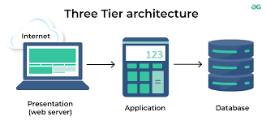

# Implementing Wordpress Website with LVM Storage Management

### What is wordpres? 

It is a web content management system. originally created as a tool to publish blogs but has evolved to support publishing other web content, including more traditional websites, mailing lists and internet forum, media galaries, membership sites, learning management systems and online stores.

### What is LVM storage?

Logical Volume Management is a form of storage virtualization that offers system administratrators a more flexible approach to managing disk storage space than traditional partitioning.

## Understanding 3 Tier Architecture

