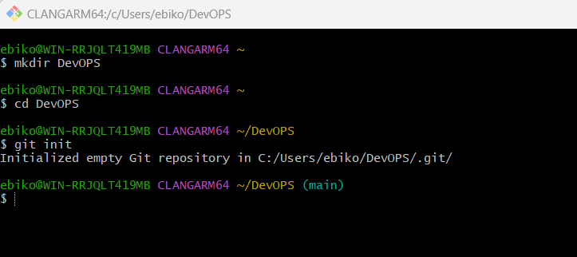
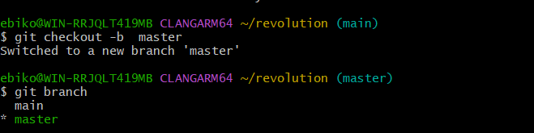
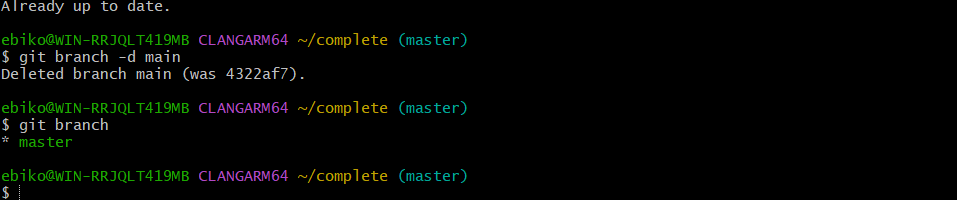
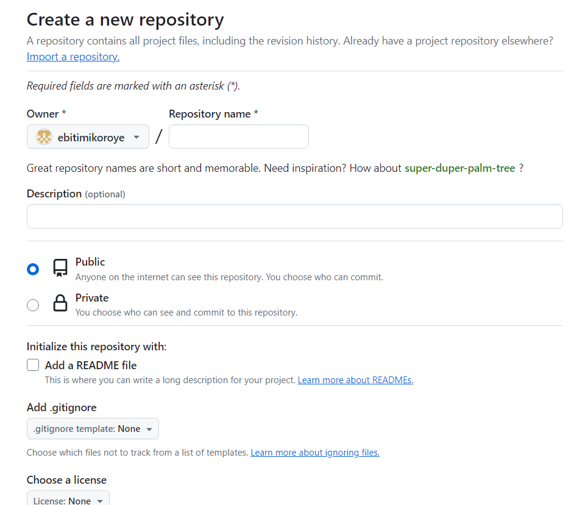
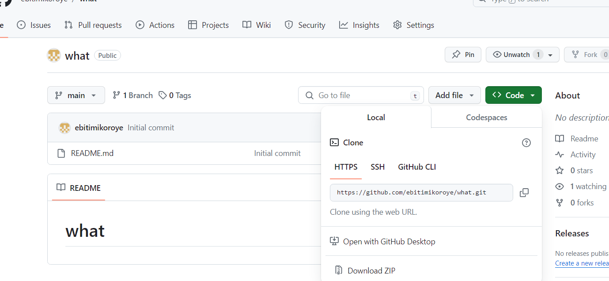
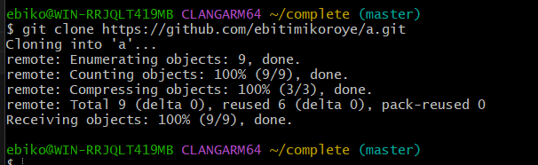

# WHAT IS GIT

## Introduction to GIT

 Git is a Version Control System that tracks changes made to a file while keeping a record of what has been done, it also gives the option of reverting back to specific versions if need be. Git permits multipul user colaboration merged ino one source.
 Git runs locally storing files and history on your computer. It is an open source meaning it is free to all, anyone can access it and modify it to their specifications.

 ### Advantages of GIT

 1)  git can be accessed using a command line or through a desktop app with a graphical user interface.
 2)  git lets users stage and commit files, you can choose specific pieces for version tracking and update
 3)  git repository contains all files and their complet revision history which is stored in a git subfolder
 4)  git sypports branching and merging, allowing concurrent workflows provides tools that handle conflicts

 ## GIT INSTALLATION

 ###  mac OS

 (Homebrew) install git on the terminal by using the command  `brew install git`

 ### Windows

 download the git installer for windows from the online site, then follow the instructions

 ### linux

 Debian/Ubuntu run the following commmand on the terminal
 `sudo apt update`
 `sudo apt install git`

 

 ## Checking the installation

 

 ## Git commands

 git init: initialize a new git repository
 git clone: create a copy of the repository on your local machine
 git add: stage changes to the next commit
 git commmit: commit changes to the repository
 git push: push local changes to repository
 git pull: fetch changes from a remote repository and merge it into the local branch
 git branch: creat, list or delete branches
 git merge: merge changes from one branch to another

 ## Git concept

 ### *Repository*

 mkdir, cd, git init

 

 ## Commit

 ### *Making your first commit*
 to make a commit, first create a file and then write a message in it useing the touch command and echo command respectively. add your changes in the terminal, and then commit

 git add .
 git commit -m "info"

 

 ### *Working with  branches*
make a new branch (git checkout -b master)
list new branch(git branch)

revert back to old branch

merge a branch into another branch (git merge main)

Deleting a git branch(git branch -d master)

### *Create a new repository*

log into your git account
at the top right click on the + icon and then go to new repositories
fill in the required details
click create project

### *Push your local git repository to your remote git repository*

### *Push the content to the remote repository*

### *Cloning remote git repository*
here is the basic syntex  (git clone <repository_url>)

