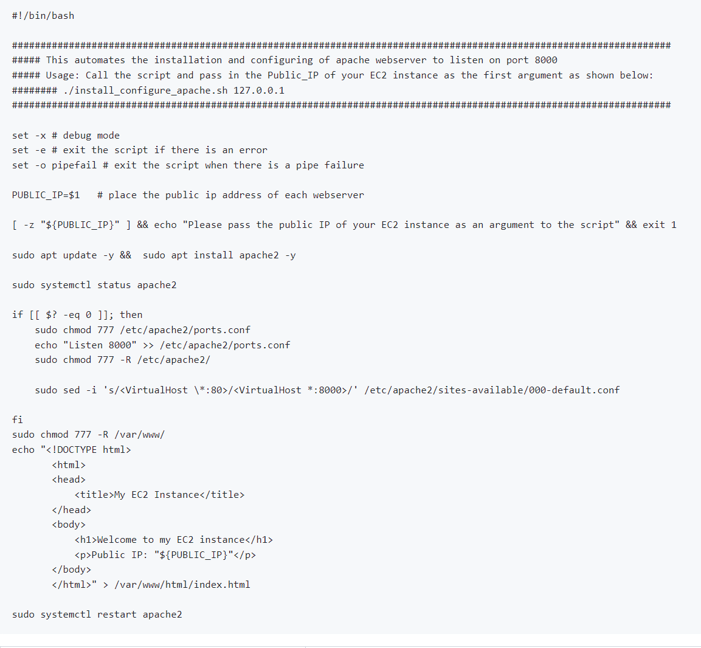
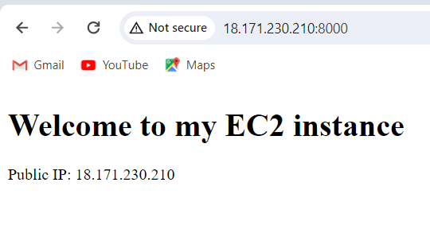
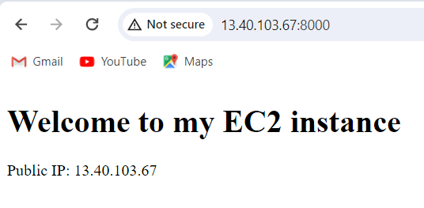
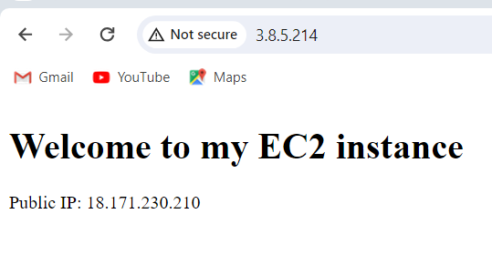

# AUTOMATING LOAD BALANCER CONFIGURATION WITH SHELL SCRIPTING

To implement load balancer with nginx, lets first deploy two backend servers and a load balancer. then we will write a shell script

### step 1

open two instances running ubuntu 20.04, and one instance running ubuntu 22.04

### step 2

allow port 8000 open on the first two instances, and port 80 from the third all from anywhere

### step 3

connect to the webservers terminal using ssh

### step 4

open a file and past this script  -[ sudo vi install.sh ]-

### step 5

change permission to make it executable -{ sudo chmod +x install.sh }-

### step 6

run the shell script using this command -{ ./install.sh Public_IP }-

## Deployment of Nginx as a load Balancer using Shell script

### step 1 

open a file using this command -{ sudo vi nginx.sh }-

### step 2

copy and paste the script 

### step 3

close the script -{ Esc : wqa! enter }-

### step 4

change the permissionto make it executable -{ sudo chmod +x nginx.sh }-

### step 5

run the script ./nginx.sh Public_IP webserver 1 webserver 2

After following the process, we should have a setup in any brouser of our choice 

